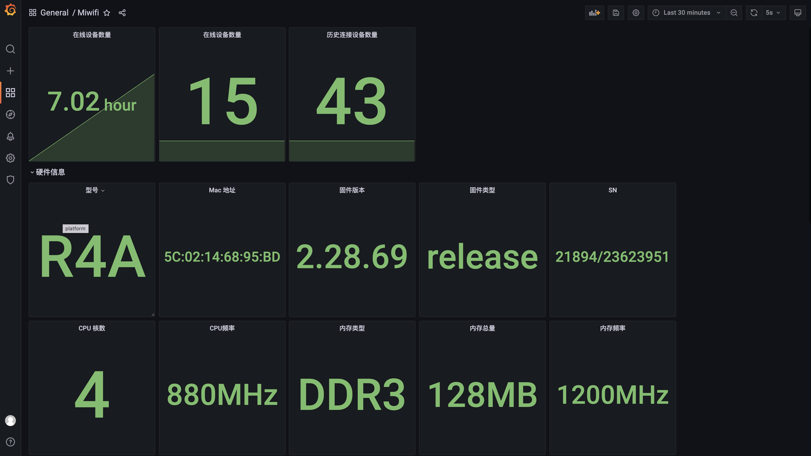
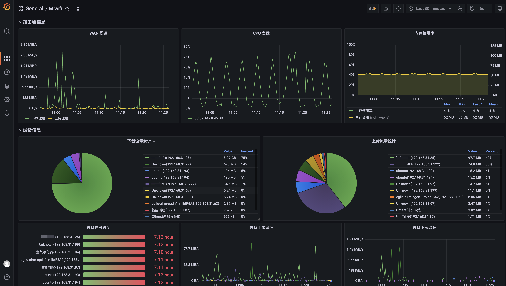

# miwifi_exporter

## 快速使用

1. 启动服务

```shell
docker run --name miwif_exporter -p 9001:9001 -e ROUTER_IP=192.168.31.1 -e ROUTER_PASSWORD=qwertyuiop hellowoodes/miwifi_expoter
```

2. 导入 Grafana 监控面板

将 `attach/grafana/grafana.json` 文件导入到 Grafana 的监控面板中

## 监控截图





